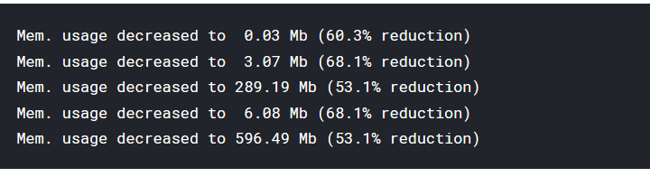

# **Great Energy predictor using LSTM model**

## I. Abstract:
We are using a dataset related to ASHRAE – Great Energy Predictor III (How much energy will a building consume?) which is a competition in Kaggle you can refer to it [here](https://www.kggle.com/c/ashrae-energy-prediction/overview). The goal is to develop models from ASHRAE’s 2016 data in order to better understand metered building energy usage in the following areas: chilled water, electric, hot water, and steam meters. The data comes from over 1,000 buildings over a one-year timeframe.

## II. Data description

The dataset includes three years of hourly meter readings from over one thousand buildings at several sites around the world. It contains some measurements and buildings information that could help for the building the model.
You can refer [here]((https://www.kggle.com/c/ashrae-energy-prediction/overview)) to learn more about dataset. 

## III. Data preparation and cleaning methods

### 1. Memory reduction

for the reason we deal with massive data, it is a well common fact to reduce the memory usage:


### 2. Visualizing the messing values

for example lets take the **building_meta**
```
site_id           0
building_id       0
primary_use       0
square_feet       0
year_built      774
floor_count    1094
dtype: int64
``` 
this image illustrates these messing data with a heatmap plot:


### 3. Merging all the data in one DataFrame

Merging the data in one dataframe called BTW_train:
```
BuildingTrain = building_meta.merge(ASHRAE_train, left_on='building_id', right_on='building_id' , how='left')
BTW_train=BuildingTrain.merge(weather_train,left_on=['site_id','timestamp'],right_on=['site_id','timestamp'],how='left')
```
and then sorting this dataframe by the meter type , building_id, primary_use, Month and Day:
``` 
BTW_train= BTW_train.groupby(['meter',BTW_train['building_id'],'primary_use',BTW_train['Month'], BTW_train['Day']]).agg({'meter_reading':'sum', 'air_temperature': 'mean', 'wind_speed': 'mean', 'precip_depth_1_hr': 'mean', 'cloud_coverage': 'mean', 'square_feet': 'mean'})
```
### 4. Filling the missing values

After preparing the data with the process described above, we should fill the missing value : 

``` 
BTW_train['precip_depth_1_hr'].fillna(method='ffill', inplace = True)
BTW_train['cloud_coverage'].fillna(method='bfill', inplace = True)

BTW_train['wind_speed'].fillna(BTW_train['wind_speed'].mean(), inplace=True)
BTW_train['air_temperature'].fillna(BTW_train['air_temperature'].mean(), inplace=True
```

## IV. DeepLearning modeling using LSTM

To solve this problem, We crate a DeepLearning model based on LSTM units. This image below will illustrate our model architecture:

``` 
Model: "sequential_5"
_________________________________________________________________
Layer (type)                 Output Shape              Param #   
=================================================================
lstm_9 (LSTM)                (None, None, 128)         71168     
_________________________________________________________________
batch_normalization_9 (Batch (None, None, 128)         512       
_________________________________________________________________
dropout_9 (Dropout)          (None, None, 128)         0         
_________________________________________________________________
lstm_10 (LSTM)               (None, 128)               131584    
_________________________________________________________________
batch_normalization_10 (Batc (None, 128)               512       
_________________________________________________________________
dropout_10 (Dropout)         (None, 128)               0         
_________________________________________________________________
dense_7 (Dense)              (None, 1)                 129       
=================================================================
Total params: 203,905
Trainable params: 203,393
Non-trainable params: 512
_________________________________________________________________
```

### 1. Metric

For the metric we use Root Mean Square Error as it is required in the competition. This type of error was manually added :

```
def root_mean_squared_error(y_true, y_pred):
  return K.sqrt(K.mean(K.square(y_pred - y_true)))
```
### 2. Early stop method
For the purpose of catching the best model behavior, we
used the early stop method to detect the best time to stop the train before it went for worse.

```
es = EarlyStopping(monitor='val_root_mean_squared_error', min_delta=0.0001, patience=5, verbose=True, mode='auto')
```
### 3. Model performance

Finally, this figure bellow will show you how the model perform: 


